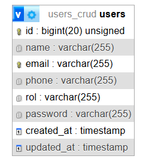
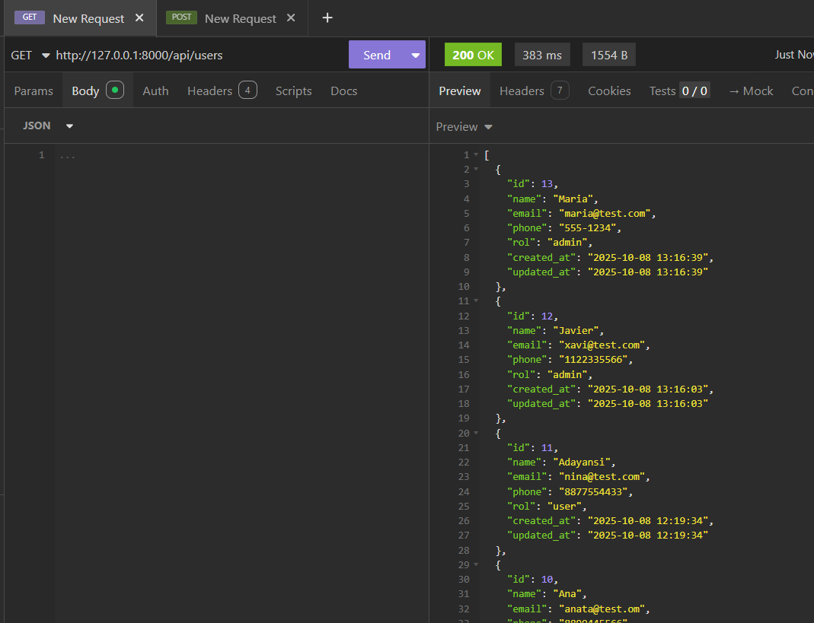
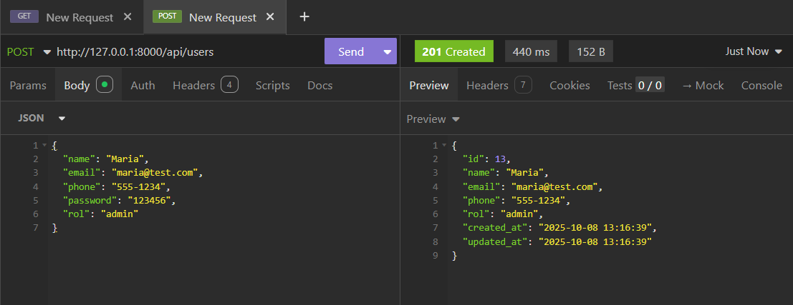
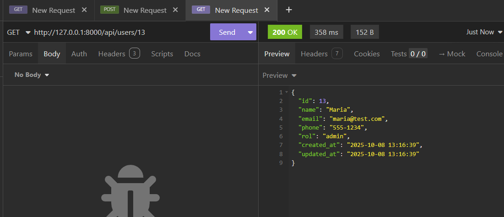
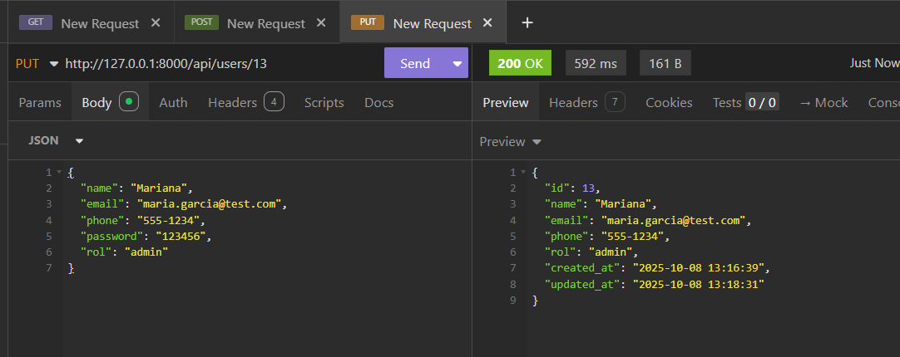
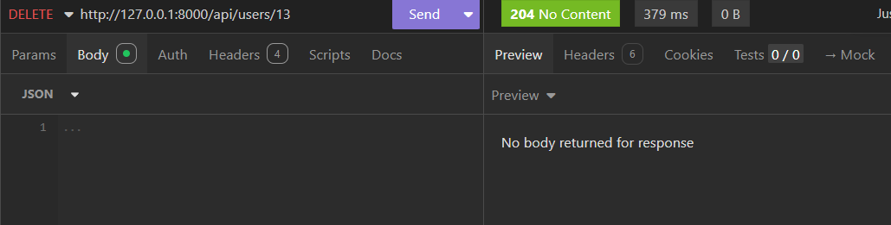

# 🚀 CRUD de Usuarios - Backend Laravel

## 📋 Descripción
Backend completo para sistema de gestión de usuarios desarrollado en Laravel. Provee API RESTful para operaciones CRUD (Crear, Leer, Actualizar, Eliminar) con autenticación y validaciones.

## 🛠️ Tecnologías Utilizadas


## 📸 Capturas de Pantalla

### Estructura de Base de Datos



### API Endpoints en Insomnia

#### GET - Listar Usuarios


#### POST - Crear Usuario


#### GET - Ver Usuario


#### PUT - Actualizar Usuario


#### DELETE - Eliminar Usuario


## 🚀 Instalación Rápida

### Prerrequisitos
- PHP 8.2 o superior
- Composer
- MySQL
- XAMPP 

### Pasos de Instalación
```bash
# Clonar el repositorio
git clone https://github.com/itzelmb6/user_crud_backend.git
cd user-crud-backend

# Instalar dependencias
composer install

# Configurar ambiente
cp .env.example .env

# Configurar base de datos en .env
DB_CONNECTION=mysql
DB_HOST=127.0.0.1
DB_PORT=3306
DB_DATABASE=users_crud
DB_USERNAME=root
DB_PASSWORD=

# Ejecutar migraciones
php artisan migrate

# Iniciar servidor
php artisan serve
